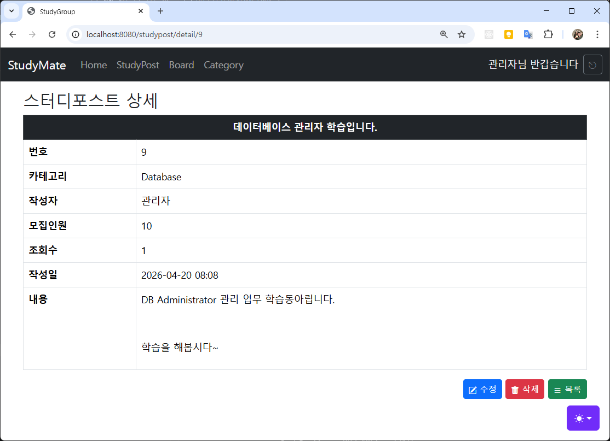
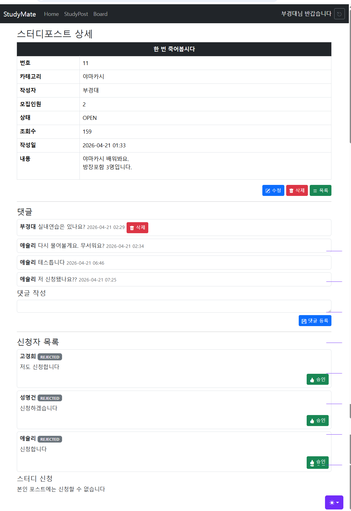
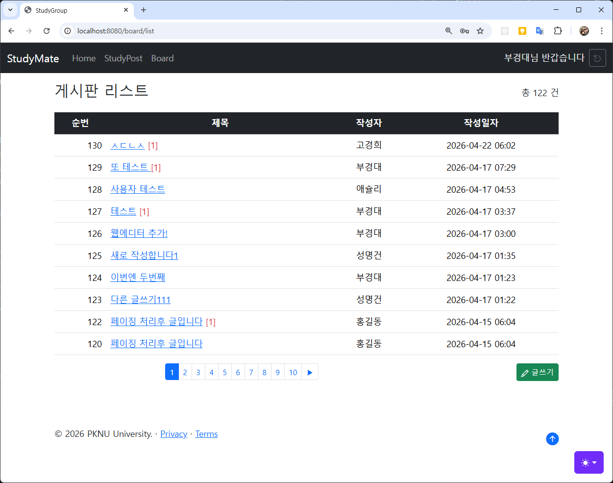
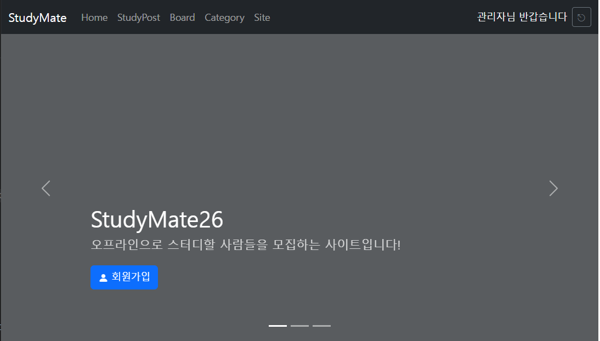
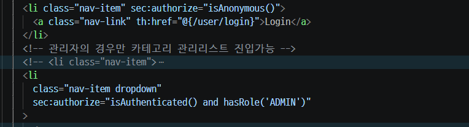
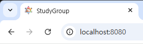

## 12일차

### ToyProject - StudyGroup

#### 스터디모집 DB설계

- 스터디모집 ERD

  

- 테이블 관계
  - 스터디 종류 카테고리 1개는 여러개의 스터디글에 포함
    - `categories 1 : N study_posts`
  - 사용자 1명은 여러개의 스터디글을 쓸 수 있음
    - `user_account 1 : N study_posts`
  - 사용자 1명은 여러개의 댓글을 쓸 수 있음
    - `user_account 1 : N comments`
  - 스터디 게시글 1개에는 여러개의 댓글이 적힘
    - `study_posts 1 : N comments`
  - 사용자 1명은 여러 스터디 게시글에 신청가능
    - `user_account 1 : N study_applications`
  - 스터디 게시글 1개에는 여러 신청이 들어옴
    - `study_posts 1 : N study_applications`

#### 스터디모집 웹사이트

```
StudyGroup
├── config : 회원가입, 로그인 시 암호화
├── controller : MVC 패턴 중 Controller 영역
├── dto : MVC 패턴 중 Model에 직접연관(DB 테이블 매핑)
├── mapper : MVC 패턴 중 Model. DB 쿼리 매핑
├── service : MVC 패턴 중 Model. 비즈니스(도메인) 로직
├── validation : MVC 패턴 중 View. 화면 입력 검증
└── resources : 웹페이지 리소스
    ├── mapper : MVC 패턴 중 Model. DB 쿼리 위치
    ├── static : View에 포함되는 이미지, CSS, 정적HTML, js 위치
    └── templates : MVC 패턴 중 View. 실제 화면을 나타낼 영역
```

- 카테고리 CRUD
  - dto, Category, StudyPost 클래스 생성
  - validation, CategoryForm 클래스 생성
  - mapper, CategoryMapper, StudyPostMapper 인터페이스, xml 생성
  - service, CategoryService, StudyPostService 클래스 생성
  - controller, Admin용 CategoryController 클래스 생성
  - templates/admin/category/list.html, form.html 생성

    

  - 수정, 삭제 기능 완료

- 스터디포스트 CRUD
  - dto, StudyPost 클래스 생성
  - mapper, StudyPostMapper 인터페이스, xml 생성
  - validation, StudyPostForm 클래스 생성. dto, StudyPost 멤버변수 복사 사용
  - service, StudyPostService 클래스 생성
  - controller, StudyPostController 클래스 생성
  - templates/post/list.html, form.html 생성

    

#### 조회수 증가

- 스터디포스트 상세보기 확인

## 13일차

#### 스터디모집 기능

- 스터디포스트 아래 댓글기능
  - dto, Comment 클래스
  - validation, CommentForm 클래스
  - mapper, CommentMapper 인터페이스
  - templates/mapper, CommentMapper.xml SQL
  - service, CommentService 클래스
  - controller, CommentController 클래스
  - controller, StudyPostController.detail() 댓글 목록, 폼 추가
  - html, post/detail.html 화면 추가

- 스터디신청 기능
  - dto, StudyApplication 클래스
  - validation, StudyApplicationForm 클래스
  - mapper, StudyApplicationMapper 인터페이스
  - templates/mapper, StudyApplication.xml
  - service, StudyApplicationService 클래스
  - controller, StudyApplicationController 클래스
  - html, post/detail.html 화면 추가

## 14일차



#### 필요이슈

- [x] 컨트롤러 post 메서드 파라미터 순서 중요
  - 입력검증 파라미터 다음에 BindingResult가 위치해야 함!
  - @Valid CommentForm commentForm, BindingResult bindingResult, ...
- [x] 스터디 신청 문제 - 신청리스트 띄워서 일단 반정도 완료
  - 중복신청 알림 없음
  - 신청 후 메시지 없음
- [x] 각 입력폼 에러메시지 디자인 통일
  - 글로벌 에러는 alert 디자인으로
  - 각 입력별 에러메시지는 단순 빨간색으로
- [x] 전체 인원이 2명인데 3명 승인 가능
- [x] 승인한 멤버에 대해서 다시 거절하는 기능
- [x] 인원이 전부 신청승인되고나면 스터디포스트 자체 상태가 CLOSED 가 되어야 함
- [x] 마감된 스터디에 신청버튼이 존재

- [ ] 스터디포스트 페이징
  - BoardMapper.xml 참조해서 StudyPostMapper.xml findAll 메서드 변경
  - BoardServiceImpl 클래스 참조해서 StudyPostService 클래스 getPostList 메서드 변경
  - StudyPostController 클래스 수정
  - templates/post/list.html 페이징 추가

- [ ] 게시판 댓글 등록 오류메시지 미출력
- home.html 관리자 관리할 화면 생성
- home.html 동적바인딩
- 기존 게시판 상세 디자인 StudyPost 상세 형태로 변경
- 로그아웃 후 home으로 이동
- 에러페이지 필요
- [x] Join, Login.html 버튼 디자인 변경
- 전체 푸터 작업
- 파일 업로드
- Spring Security
- JWT
- React와 연동



## 15일차

### StudyGroup 계속

#### 관리자 홈 관리 화면

- Site 테이블 생성
- dto, Site 클래스
- validation, SiteForm 클래스
- controller, SiteController 클래스
- mapper, SiteMapper 인터페이스
- templates/mapper, SiteMapper.xml
- service, SiteService 클래스



- 이미지 관리
  - application.properties 에 저장경로 설정!
  - config, FileProperties 클래스 추가
  - config, WebMvcConfig 클래스 추가
  - Site_Image 테이블 생성
  - dto, SiteImage 클래스
  - validation, SiteImageForm 클래스
  - mapper, SiteImageMapper 인터페이스
  - templates/mapper, SiteImageMapper.xml
  - service, SiteImageService 클래스
  - controller, SiteImageController 클래스
  - controller, HomeController home 메서드 수정

#### 남은 이슈

- [x] favicon 추가
  - 자동인식방법 resources/static/favicon.ico
  - png to ico 변환필요

  

- [x] 에러페이지 필요 - 디자인만 잘하면 됨
  - 404 에러 : Page Not Found
  - 500 에러 : Internal Server Error

- home.html 관리자 관리할 화면 생성
  - Hero 이미지 : 웹 전체 화면을 채우는 배경이미지
  - Carousel : 이미지가 일정시간마다 전환, 또는 버튼클릭으로 전환되는 디자인
  - 현재 화면

  

- 미니프로젝트 팀 구성
- 미니프로젝트 주제
